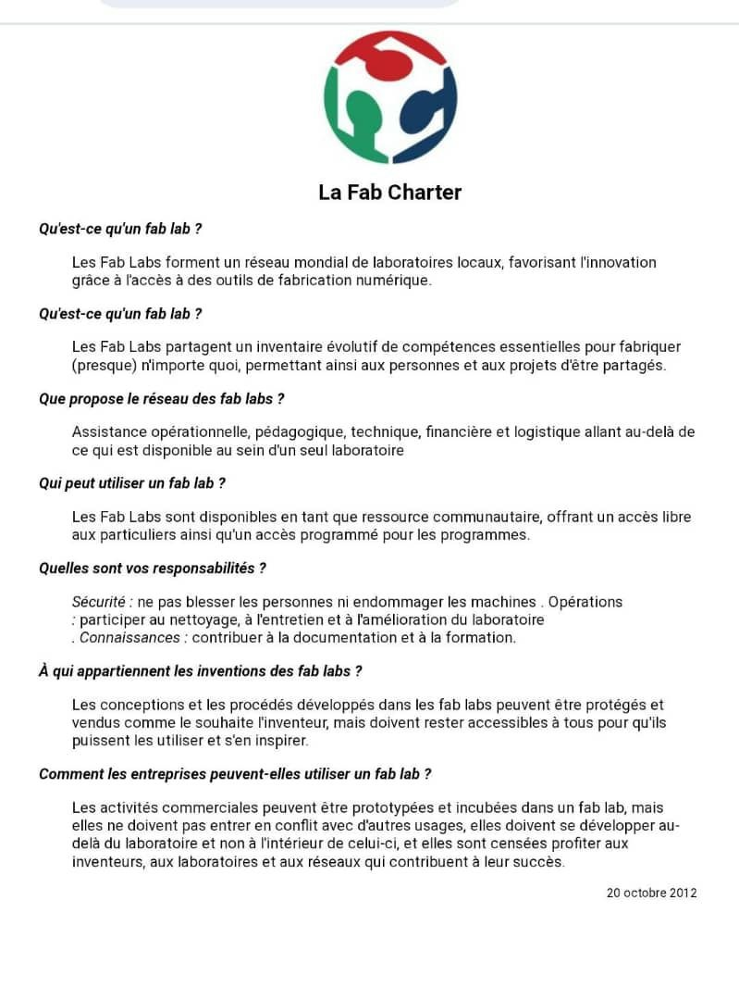

# Jour 2 — Mardi 25 août 2026

**Nom :** BATABADI Eninam Thierry  
**Formation :** Formation des Fab Managers — PNFA 2026-2027

## 1. Fait aujourd'hui

Cette deuxième journée a commencé par la pratique de **Git et GitHub avec Visual Studio Code**. Nous avons appris à créer et organiser les fichiers de notre dépôt, à utiliser le contrôle de source et à effectuer nos premiers **commits**.

Nous avons également configuré notre identité Git et appris à synchroniser notre travail avec GitHub.

*Prise en main de Git et du contrôle de source dans Visual Studio Code.*

La suite de la journée a été consacrée à la découverte de l'univers des **FabLabs** avec **M. Sylvestre Olanlo**. Nous avons abordé leur origine, leur évolution, leur fonctionnement ainsi que les principes de la **Fab Charter**.

*Découverte des principes de la Fab Charter.*

## 2. Appris

J'ai appris à mieux comprendre le fonctionnement de **Git, GitHub et Visual Studio Code**, notamment la différence entre enregistrer une modification avec un commit et synchroniser le travail avec GitHub.

J'ai également mieux compris l'esprit d'un FabLab : **fabriquer, apprendre, partager et documenter**.

## 3. Raté puis corrigé

Au début, les différentes étapes entre **modification, commit et synchronisation** n'étaient pas encore très claires pour moi. Les exercices pratiques m'ont permis de mieux comprendre le processus.

## 4. Décidé

J'ai décidé d'utiliser régulièrement mon dépôt GitHub pour conserver mon journal, mes fichiers et les différentes réalisations de la formation.

## 5. À faire demain

- Continuer à pratiquer Git et GitHub ;
- découvrir davantage les équipements du FabLab ;
- participer aux différents ateliers pratiques ;
- documenter les activités réalisées.

---

**BATABADI Eninam Thierry**  
*25 août 2026*