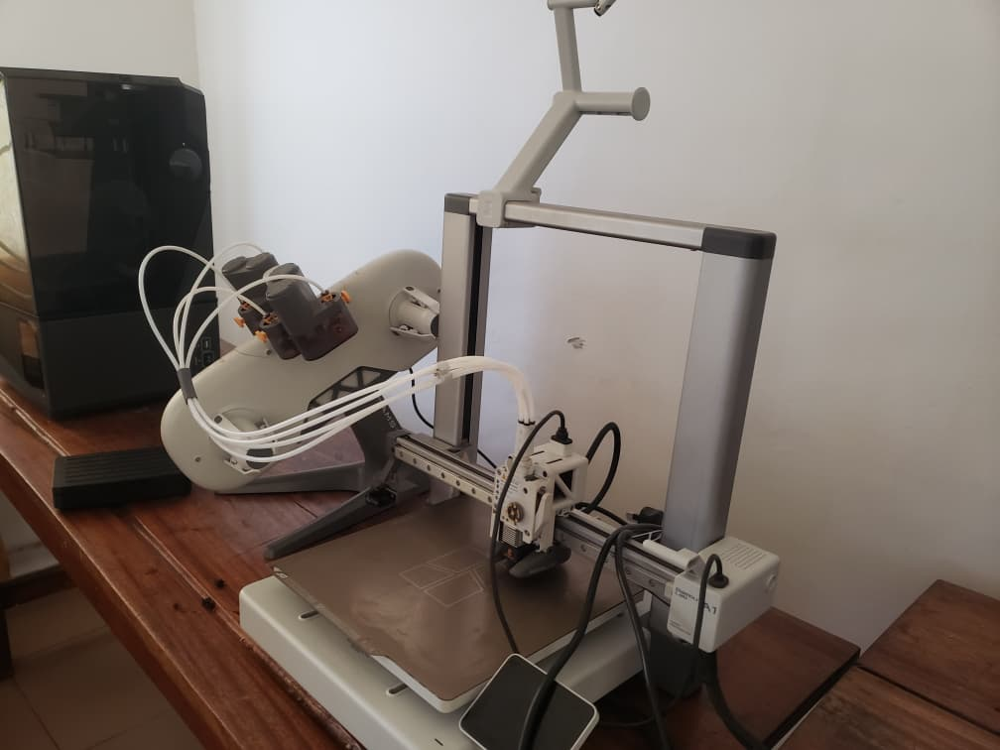

# Jour 3 — Mercredi 26 août 2026

**Nom :** BATABADI Eninam Thierry  
**Formation :** Formation des Fab Managers — PNFA 2026-2027

## 1. Fait aujourd'hui

Cette troisième journée a été consacrée à des **ateliers pratiques en rotation**. J'étais dans le quatrième groupe et nous avons travaillé sur plusieurs domaines : **fabrication additive, gestion de projet, fabrication laser et électronique**.

En fabrication additive, nous avons découvert plusieurs technologies d'impression 3D, notamment **FDM, SLA et SLS**, ainsi que des matériaux comme le **PLA et le PETG**. Nous avons également abordé quelques paramètres importants d'impression et les précautions de conservation des filaments.

*Découverte des équipements et technologies d'impression 3D.*

Nous avons ensuite installé et pris en main **xTool Studio**. Le formateur nous a présenté le principe du laser, les principales parties de la machine ainsi que différentes familles de machines xTool.

En électronique, nous avons étudié les notions de **tension, courant et résistance**, ainsi que la loi d'Ohm :

**U = R × I**

Nous avons ensuite utilisé le **multimètre** pour effectuer des mesures sur des piles et des résistances, puis appris à lire le code couleur des résistances.

*Manipulation et découverte des composants pendant l'atelier d'électronique.*

## 2. Appris

J'ai appris à distinguer plusieurs procédés d'impression 3D et à mieux comprendre le rôle des matériaux utilisés.

J'ai également découvert les bases de la fabrication laser avec xTool et appris à utiliser un multimètre pour effectuer des mesures électriques.

## 3. Raté puis corrigé

Je n'ai pas rencontré de difficulté particulière à signaler pendant cette journée.

## 4. Décidé

J'ai décidé de continuer à pratiquer les différents outils et machines découverts afin de mieux comprendre leur fonctionnement et leurs domaines d'utilisation.

## 5. À faire demain

- Continuer les ateliers pratiques ;
- approfondir l'impression 3D ;
- poursuivre la pratique de l'électronique ;
- continuer la prise en main des outils de fabrication numérique.

---

**BATABADI Eninam Thierry**  
*26 août 2026*