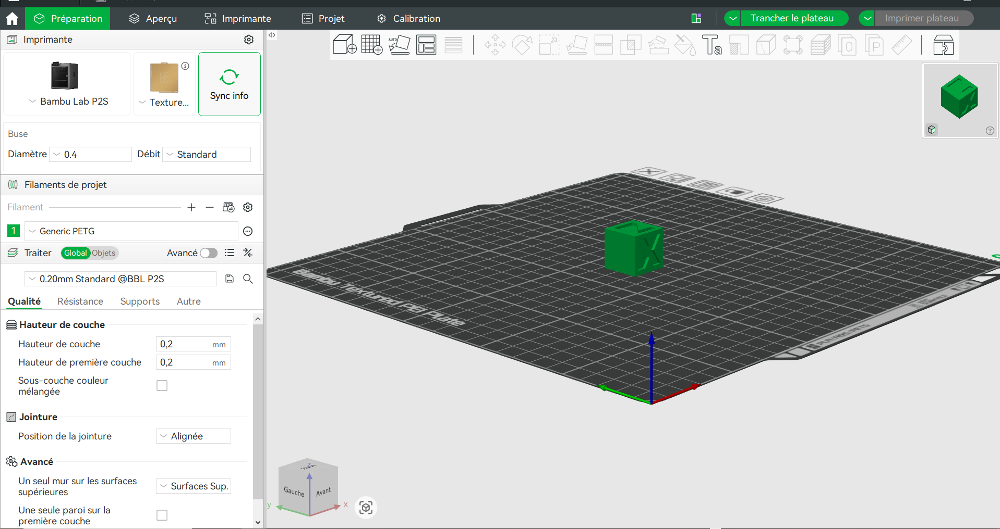
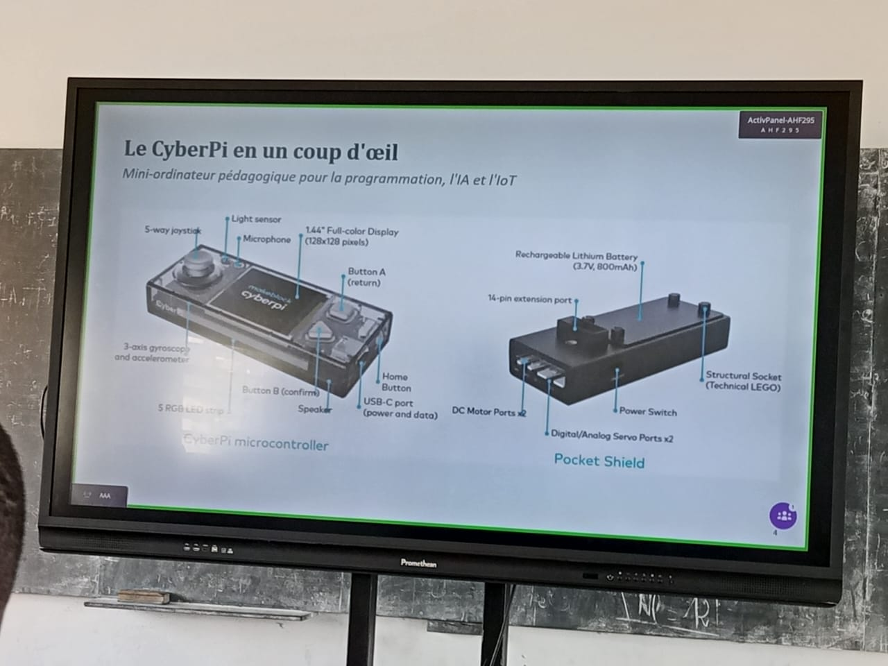

# Jour 4 — Jeudi 27 août 2026

**Nom :** BATABADI Eninam Thierry  
**Formation :** Formation des Fab Managers — PNFA 2026-2027

## 1. Fait aujourd'hui

Cette journée a été consacrée à la poursuite des **ateliers pratiques**.

En impression 3D, nous avons travaillé avec **Bambu Studio**. J'ai découvert son interface et plusieurs paramètres de préparation d'une pièce avant impression : choix du profil, orientation du modèle, hauteur de couche, remplissage et supports.

*Prise en main de Bambu Studio pour préparer une impression 3D.*

En électronique, nous avons découvert le **CyberPi** et utilisé **mBlock** pour réaliser de petits programmes et commander les LED.

*Initiation à la programmation du CyberPi.*

Nous avons également poursuivi l'atelier de fabrication laser avec **xTool**, notamment à travers la conception d'une carte de visite destinée à la gravure.

🎥 [Voir la vidéo de l'atelier](../medias/VID_20260827_114707.mp4)

## 2. Appris

J'ai appris qu'avant une impression 3D, il est important de bien préparer le modèle et de vérifier les paramètres dans le logiciel de tranchage.

J'ai également découvert la programmation du CyberPi avec mBlock et poursuivi ma prise en main des outils de fabrication laser.

## 3. Raté puis corrigé

Certains paramètres de Bambu Studio étaient encore nouveaux pour moi. Les manipulations réalisées pendant l'atelier m'ont permis de mieux comprendre leur rôle.

## 4. Décidé

J'ai décidé de continuer à pratiquer les différents logiciels afin d'être progressivement plus autonome dans la préparation et la fabrication de mes projets.

## 5. À faire demain

- Continuer la pratique de Bambu Studio ;
- poursuivre les exercices avec CyberPi et mBlock ;
- continuer le travail sur la carte de visite ;
- documenter les réalisations.

---

**BATABADI Eninam Thierry**  
*27 août 2026*