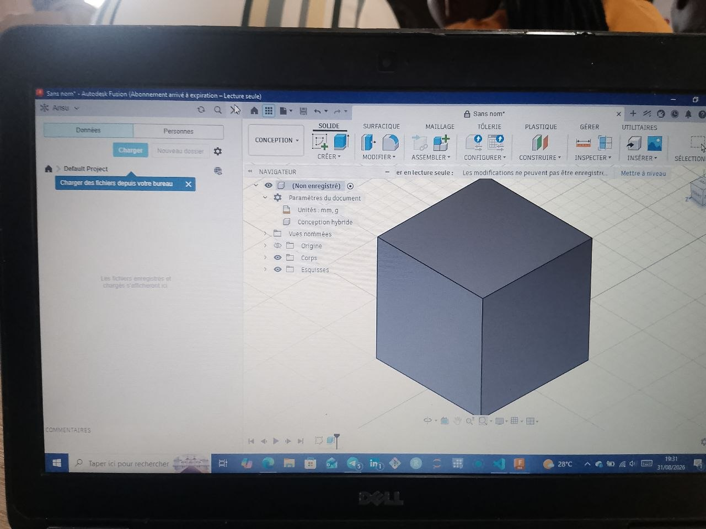

# Jour 7 — Lundi 31 août 2026

**Nom :** BATABADI Eninam Thierry  
**Formation :** Formation des Fab Managers — PNFA 2026-2027

## 1. Fait aujourd'hui

Cette journée a commencé par un **travail en groupe sur notre projet**. Après discussion, nous avons décidé d'abandonner notre première idée intitulée **« Réservation et habilitation d'un FabLab »** pour nous orienter vers un nouveau projet :

### **Distributeur automatique de savon liquide**

Nous avons commencé à réfléchir au fonctionnement du dispositif, au **matériel nécessaire** et à la préparation de son **cahier des charges**.

L'après-midi, nous avons suivi une initiation à **Fusion 360** avec **M. SITOU LAWSON**. Nous avons découvert l'interface du logiciel et les bases de la modélisation 3D, notamment la création d'une **esquisse**, l'utilisation des dimensions et la transformation d'une esquisse en objet 3D.

*Exercice de modélisation 3D avec Fusion 360.*

## 2. Appris

J'ai appris qu'un projet peut évoluer lorsqu'une autre solution apparaît plus **pertinente et réalisable**.

J'ai également appris les premières étapes de modélisation avec Fusion 360 : **créer une esquisse, appliquer des contraintes et des dimensions, puis générer un volume 3D**.

## 3. Raté puis corrigé

Je n'ai pas rencontré de difficulté particulière à signaler pendant cette journée.

## 4. Décidé

Avec mon groupe, nous avons décidé de poursuivre désormais le projet de **distributeur automatique de savon liquide** et de travailler progressivement sur sa conception, son électronique et son fonctionnement.

## 5. À faire demain

- Continuer la prise en main de Fusion 360 ;
- poursuivre la définition de notre distributeur automatique ;
- préciser les composants nécessaires ;
- continuer à documenter l'évolution du projet.

---

**BATABADI Eninam Thierry**  
*31 août 2026*