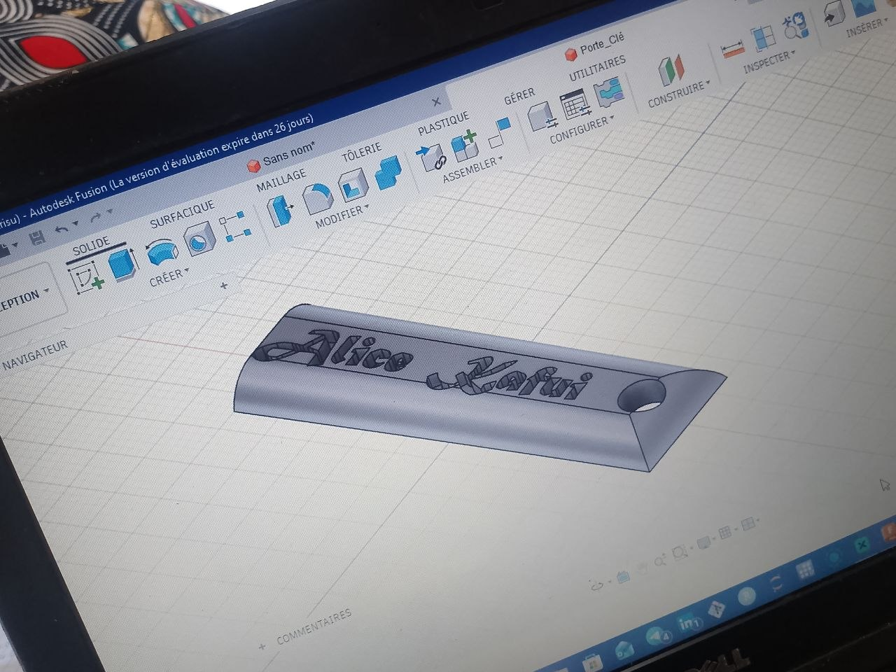
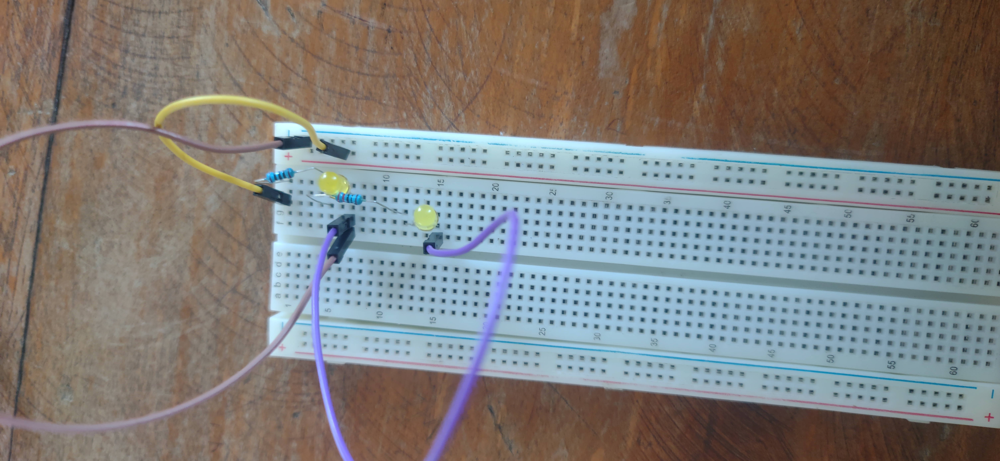
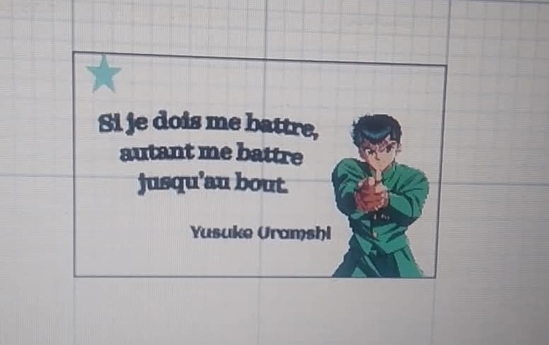

# Jour 8 — Mardi 1er septembre 2026

**Nom :** BATABADI Eninam Thierry  
**Formation :** Formation des Fab Managers — PNFA 2026-2027

## 1. Fait aujourd'hui

Cette journée a commencé par la poursuite de la **modélisation 3D avec Fusion 360**. Nous avons réalisé différents exercices pour mieux maîtriser les esquisses, les dimensions, l'extrusion et les congés. Nous avons notamment travaillé sur la conception d'un **porte-clé personnalisé**.

*Exercice de modélisation d'un porte-clé avec Fusion 360.*

Nous avons également réalisé des manipulations en **électronique sur une plaque SK10**, afin de mieux comprendre le branchement des composants et la réalisation d'un circuit.

*Manipulation pratique en électronique sur une plaque de prototypage.*

Une autre partie importante de la journée a été consacrée à la découverte de l'impression textile **DTF (Direct To Film)** avec les équipements xTool. Nous avons suivi les différentes étapes allant de la préparation du visuel jusqu'au transfert sur le textile à l'aide d'une presse à chaud.

*Découverte du procédé d'impression textile DTF.*

## 2. Appris

J'ai appris à utiliser davantage les outils de Fusion 360 pour transformer une esquisse en une pièce 3D personnalisée.

J'ai également mieux compris le rôle de la plaque de prototypage dans la réalisation et le test d'un montage électronique.

Enfin, j'ai découvert le principe du **DTF**, qui permet de transférer un visuel imprimé sur différents textiles.

## 3. Raté puis corrigé

Je n'ai pas rencontré de difficulté particulière à signaler pendant cette journée.

## 4. Décidé

J'ai décidé de continuer à pratiquer Fusion 360, car la modélisation 3D pourra nous être utile pour concevoir certaines parties physiques de notre **distributeur automatique de savon liquide**.

## 5. À faire demain

- Continuer les activités pratiques ;
- approfondir la programmation ;
- poursuivre le travail sur notre projet de groupe ;
- commencer à réfléchir à la forme et à l'organisation physique du distributeur.

---

**BATABADI Eninam Thierry**  
*1er septembre 2026*