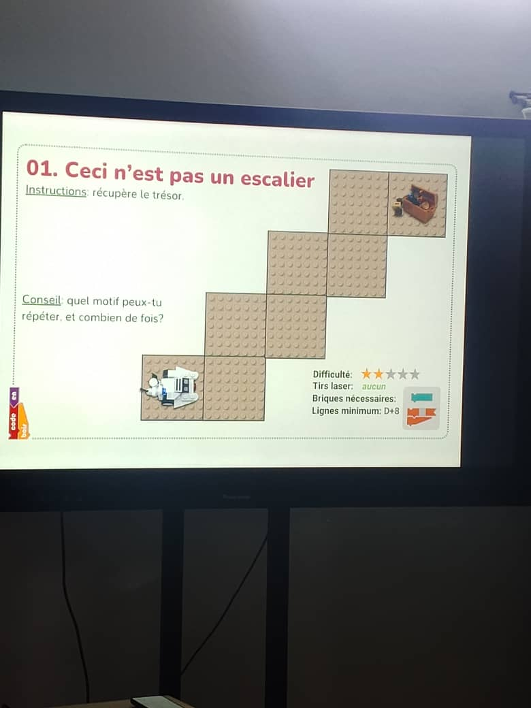

# Jour 9 — Mercredi 2 septembre 2026

**Nom :** BATABADI Eninam Thierry  
**Formation :** Formation des Fab Managers — PNFA 2026-2027

## 1. Fait aujourd'hui

La matinée a été consacrée à une session sur **les fondamentaux de l'algorithme pour un Fab Manager**, animée par **M. WISDOM**.

Nous avons abordé la définition d'un algorithme, ses principales caractéristiques ainsi que la notion d'**algorithme débranché**, qui permet de comprendre la logique d'une suite d'instructions sans utiliser directement un ordinateur.

*Exercice pratique utilisé pour comprendre la logique d'un algorithme sans programmation sur ordinateur.*

Nous avons ensuite travaillé avec le **mBot2 et le CyberPi**. Nous avons manipulé le robot et réalisé des exercices de programmation pour lui faire exécuter différentes instructions.

*Découverte et programmation du robot mBot2.*

L'après-midi, nous avons poursuivi le travail sur notre **distributeur automatique de savon liquide**. Avec mon groupe, nous avons réalisé un **premier croquis à la main** afin de commencer à représenter la forme du distributeur et l'organisation générale de ses éléments.

## 2. Appris

J'ai appris qu'un algorithme est une **suite organisée d'instructions permettant de résoudre un problème ou d'accomplir une tâche**.

Les exercices avec le mBot2 m'ont également permis de mieux comprendre le lien entre un algorithme, un programme et le comportement réel d'une machine.

## 3. Raté puis corrigé

Je n'ai pas rencontré de difficulté particulière à signaler pendant cette journée.

## 4. Décidé

Avec mon groupe, nous avons décidé de partir du **croquis du distributeur** pour poursuivre progressivement sa conception et réfléchir au positionnement des différents composants.

## 5. À faire demain

- Continuer l'apprentissage de la programmation ;
- poursuivre la conception du distributeur ;
- améliorer notre croquis ;
- réfléchir au positionnement des composants du système.

---

**BATABADI Eninam Thierry**  
*2 septembre 2026*