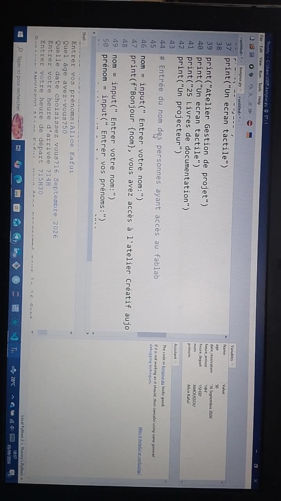

# Jour 10 — Jeudi 3 septembre 2026

**Nom :** BATABADI Eninam Thierry  
**Formation :** Formation des Fab Managers — PNFA 2026-2027

## 1. Fait aujourd'hui

Cette journée a été consacrée à une **initiation à la programmation Python**.

Nous avons découvert les bases de Python et son utilisation avec **Thonny**. Nous avons commencé par des notions simples comme l'affichage avec `print()`, les commentaires, les variables et les principaux types de données : nombres entiers, nombres décimaux, chaînes de caractères et booléens.

*Découverte des bases de la programmation Python.*

Nous avons également travaillé sur la saisie de données, les conversions de types et la manière d'afficher plusieurs informations dans un programme.

*Prise en main de Thonny pour écrire et exécuter des programmes Python.*

Une partie de la journée a aussi été consacrée au **travail en groupe sur notre distributeur automatique de savon liquide**. Nous avons poursuivi la réflexion sur sa conception et l'organisation des différents éléments nécessaires à sa réalisation.

## 2. Appris

J'ai appris les premières règles de syntaxe de Python et le rôle des **variables et des types de données**.

J'ai également appris à écrire puis à exécuter un petit programme avec Thonny et à observer le résultat dans la console.

## 3. Raté puis corrigé

Je n'ai pas rencontré de difficulté particulière à signaler pendant cette journée.

## 4. Décidé

J'ai décidé de poursuivre l'apprentissage de Python afin de pouvoir l'utiliser progressivement pour la programmation des systèmes électroniques et des projets du FabLab.

## 5. À faire demain

- Continuer l'apprentissage de Python ;
- travailler sur les conditions et les boucles ;
- réaliser de nouveaux exercices pratiques ;
- poursuivre le travail sur notre projet de groupe.

---

**BATABADI Eninam Thierry**  
*3 septembre 2026*