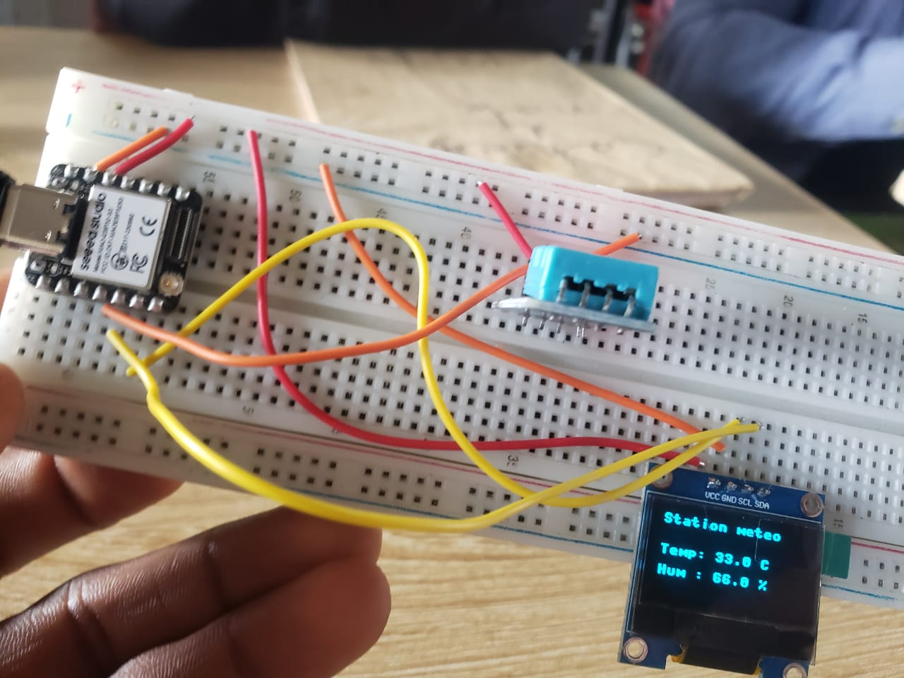

# Jour 12 — Samedi 5 septembre 2026

**Nom :** BATABADI Eninam Thierry  
**Formation :** Formation des Fab Managers — PNFA 2026-2027

## 1. Fait aujourd'hui

Cette journée a été consacrée à un atelier pratique autour de la réalisation d'une **station météorologique intelligente** avec **M. EDJARA**.

Nous avons utilisé une carte **XIAO ESP32-S3**, une plaque de prototypage, un capteur de température et d'humidité ainsi qu'un **écran OLED**. La programmation a été réalisée avec **Thonny**.

L'objectif était de récupérer les informations provenant du capteur et de les afficher sur l'écran OLED.

*Montage pratique de la station météorologique.*

Nous avons écrit et exécuté le programme dans Thonny, puis observé les données fournies par le système.

.jpg>)

*Affichage des données obtenues lors des essais de la station météorologique.*

## 2. Appris

J'ai appris à mieux comprendre le rôle d'un **microcontrôleur, d'un capteur et d'un écran OLED** dans un système électronique.

J'ai également appris à créer et exécuter un fichier Python avec Thonny et à comprendre comment un programme peut récupérer les données d'un capteur pour ensuite les afficher.

## 3. Raté puis corrigé

Pendant les essais, les informations ne s'affichaient pas correctement sur l'écran OLED. Après vérification du montage, nous avons constaté que **certains fils étaient déconnectés**. Une fois les connexions rétablies, nous avons pu poursuivre les tests.

Nous n'avons également pas pu réaliser l'impression 3D du boîtier prévu pour la station.

## 4. Décidé

J'ai décidé d'approfondir l'utilisation du **XIAO ESP32-S3 avec Thonny**, car cette expérience pourra être utile pour nos futurs montages électroniques et notre projet de groupe.

## 5. À faire demain

- Revoir le fonctionnement du XIAO ESP32-S3 ;
- pratiquer davantage la programmation avec Thonny ;
- approfondir le branchement des capteurs et des écrans ;
- poursuivre les ateliers pratiques de la formation.

---

**BATABADI Eninam Thierry**  
*5 septembre 2026*