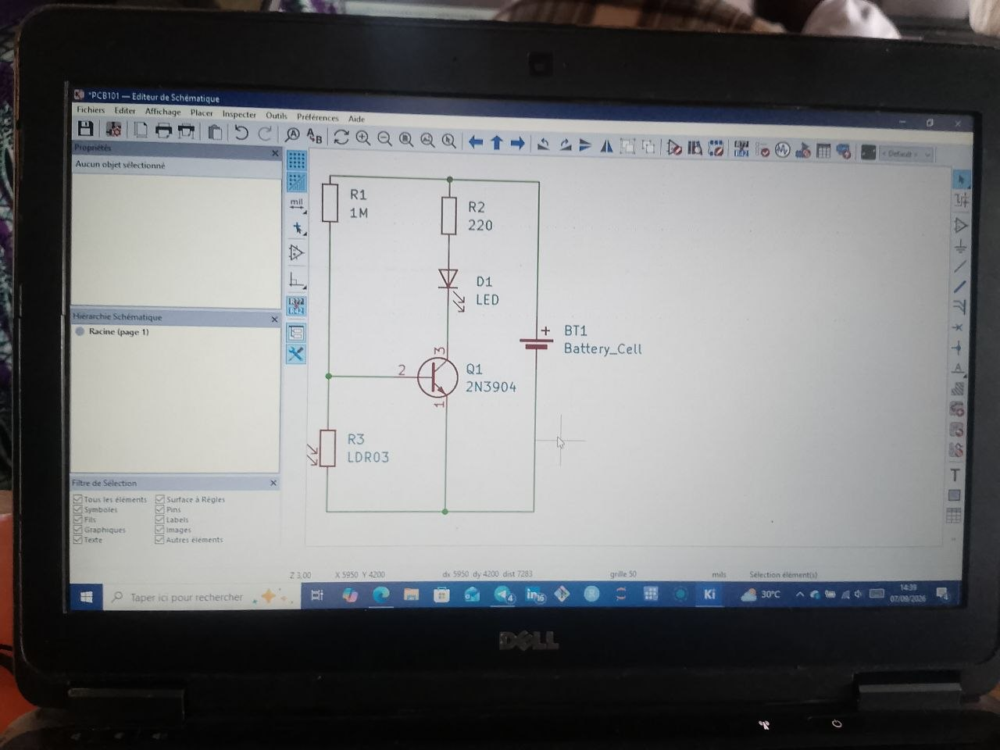
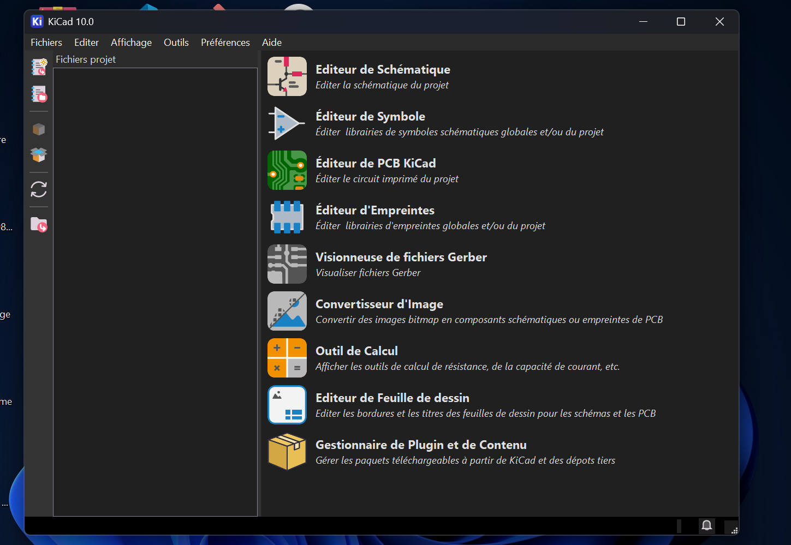

# Jour 13 — Lundi 7 septembre 2026

**Nom :** BATABADI Eninam Thierry  
**Formation :** Formation des Fab Managers — PNFA 2026-2027

## 1. Fait aujourd'hui

Cette journée a été consacrée à la découverte des **circuits imprimés (PCB)** et à la prise en main de **KiCad**.

Nous avons commencé par comprendre la différence entre un montage réalisé sur une plaque de prototypage et un **circuit imprimé**, ainsi que les principales étapes permettant de passer d'un schéma électronique à un PCB.

Pour la partie pratique, nous avons travaillé sur un petit **circuit de détection de lumière** utilisant notamment une LED, des résistances, une photorésistance **LDR** et un transistor.

*Schématisation du circuit électronique utilisé pendant l'exercice.*

Nous avons ensuite découvert **KiCad** pour représenter le schéma électronique et commencer à comprendre l'organisation des composants et leurs connexions.

*Prise en main de KiCad pour la conception électronique.*

## 2. Appris

J'ai appris qu'avant de concevoir un PCB, il faut d'abord réaliser correctement le **schéma électronique**, identifier les composants et vérifier leurs connexions.

J'ai également découvert les premières notions de **symbole, empreinte (footprint) et piste**, qui permettent de passer progressivement du schéma au circuit imprimé.

## 3. Raté puis corrigé

Je n'ai pas rencontré de difficulté particulière à signaler pendant cette journée.

## 4. Décidé

J'ai décidé de continuer à apprendre KiCad afin de mieux comprendre les différentes étapes de conception d'un circuit électronique.

## 5. À faire demain

- Continuer la prise en main de KiCad ;
- approfondir les différentes étapes de conception électronique ;
- poursuivre les activités pratiques de la formation ;
- continuer le travail sur notre projet de groupe.

---

**BATABADI Eninam Thierry**  
*7 septembre 2026*