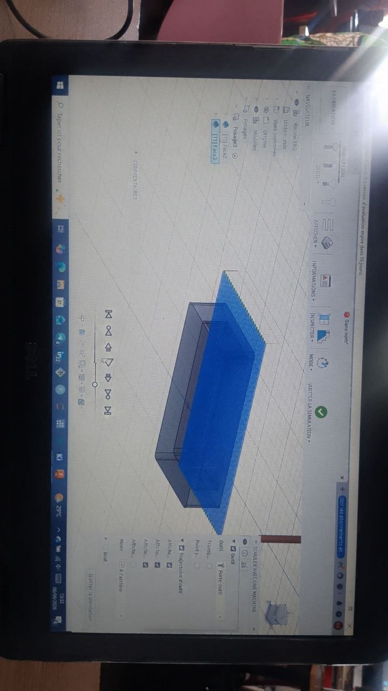
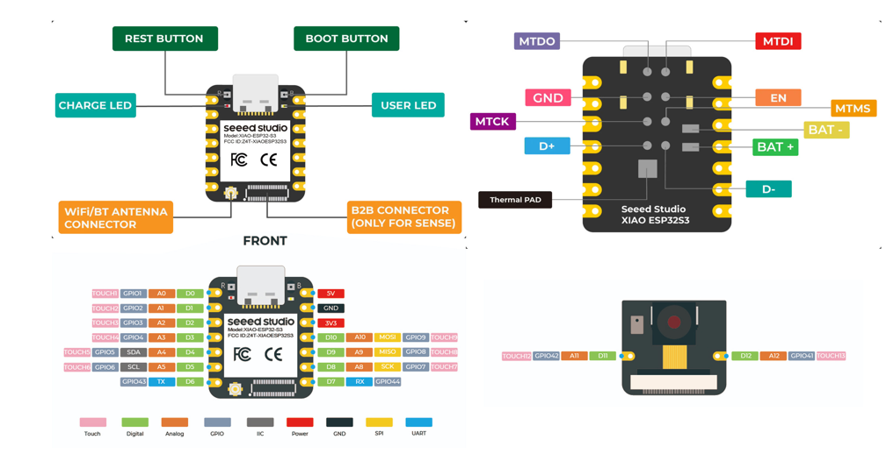

# Jour 14 — Mardi 8 septembre 2026

**Nom :** BATABADI Eninam Thierry  
**Formation :** Formation des Fab Managers — PNFA 2026-2027

## 1. Fait aujourd'hui

La matinée a été consacrée à la **Fabrication Assistée par Ordinateur (FAO) avec Fusion 360**, sous la conduite de **M. SITOU**.

Nous avons découvert l'espace **Manufacture** de Fusion 360 et les différentes étapes permettant de préparer une pièce pour l'usinage : définition du brut, choix des opérations, réglage des paramètres, simulation du parcours de l'outil et génération du programme d'usinage.

*Découverte de la Fabrication Assistée par Ordinateur avec Fusion 360.*

L'après-midi, nous avons poursuivi le travail sur notre **distributeur automatique de savon liquide**.

Pour avancer sur le prototype, notre groupe a reçu plusieurs composants : une **carte XIAO ESP32-S3, des panneaux solaires, un capteur ultrason, une plaque SK10, des fils de connexion, deux LED et quatre résistances**.

*Une partie du matériel destiné à la réalisation de notre distributeur automatique de savon liquide.*

Nous avons commencé à réfléchir à la manière dont ces différents composants pourront être intégrés au fonctionnement du distributeur.

## 2. Appris

J'ai appris que la FAO permet de préparer numériquement les opérations nécessaires à la fabrication d'une pièce sur une machine-outil.

J'ai également compris l'importance de la **simulation** avant l'usinage afin de visualiser le parcours de l'outil et de vérifier le travail préparé.

## 3. Raté puis corrigé

Je n'ai pas rencontré de difficulté particulière à signaler pendant cette journée.

## 4. Décidé

Avec mon groupe, nous avons décidé de poursuivre le projet en étudiant progressivement le rôle de chaque composant reçu et la manière de les connecter autour du **XIAO ESP32-S3**.

## 5. À faire demain

- Continuer le travail sur notre distributeur automatique ;
- étudier le branchement des composants reçus ;
- poursuivre l'apprentissage de l'électronique ;
- préparer les prochaines étapes du prototype.

---

**BATABADI Eninam Thierry**  
*8 septembre 2026*