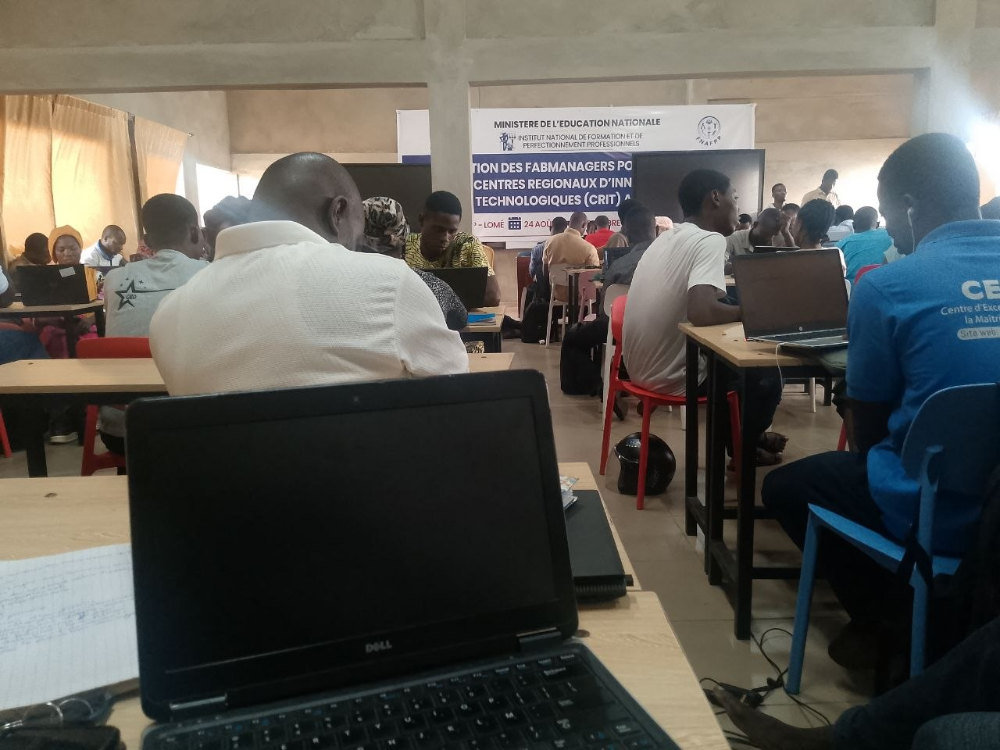

# Jour 6 — Samedi 29 août 2026

**Nom :** BATABADI Eninam Thierry  
**Formation :** Formation des Fab Managers — PNFA 2026-2027

## 1. Fait aujourd'hui

Cette sixième journée a été principalement consacrée à la **gestion de projet et au choix des projets de groupe**.

À partir d'un ensemble d'environ **150 propositions de projets**, nous avons travaillé en groupes de quatre pour analyser différentes idées et identifier celles qui pouvaient être réalisées dans le cadre de la formation.

Pour chaque proposition, nous devions notamment réfléchir au **problème à résoudre, à l'utilité du projet, aux principales fonctionnalités, aux composants nécessaires et à sa faisabilité** avec le temps et les moyens disponibles.

*Travail en groupe autour du choix et de l'analyse des projets.*

Les différents groupes ont ensuite présenté et défendu leurs propositions. Les échanges avec les formateurs et les autres participants nous ont permis de questionner certaines idées et de mieux réfléchir à leur faisabilité.

## 2. Appris

J'ai compris qu'une idée intéressante ne suffit pas pour constituer un bon projet. Il faut d'abord identifier clairement le **besoin**, définir ce que le système doit réaliser et vérifier si le projet est **réalisable avec les ressources disponibles**.

J'ai également compris l'importance de pouvoir expliquer et défendre les choix effectués par le groupe.

## 3. Raté puis corrigé

Je n'ai pas rencontré de difficulté particulière à signaler pendant cette journée.

## 4. Décidé

Avec mon groupe, nous avons décidé de poursuivre la réflexion sur notre projet en tenant compte des remarques reçues et de sa faisabilité technique.

## 5. À faire demain

- Revoir les idées retenues avec mon groupe ;
- préciser le besoin auquel notre projet doit répondre ;
- identifier les fonctions et le matériel nécessaires ;
- préparer la suite du travail sur le projet.

---

**BATABADI Eninam Thierry**  
*29 août 2026*